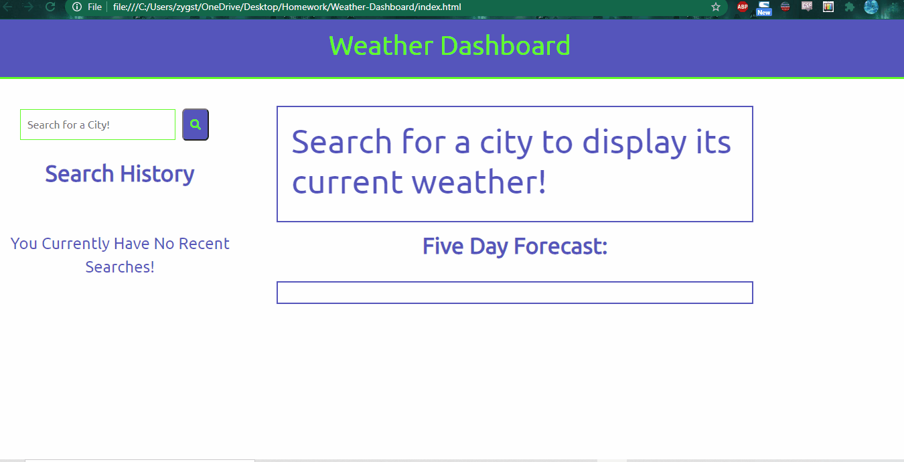

# Weather Dashboard

A (somewhat) functional weather dashboard, to search by city and display the current and future weather.

# Purpose of Repository

This repository was made to be a functioning weather app. The user searches by city to have relevant weather data displayed for the current date and for the next five days. It was designed to test the coder's ability to utilize jQuery, third-party APIs with ajax queries, and local storage properties.

# Description of Repository

This repository has all the components of a (mostly) functioning weather app. A search bar sits in the upper left, where a user can enter the name of a city. On submission, the current date, the city's name, temperature, humidity, wind speed, UV index (complete with a color indicating the threat level of UV radiation), and an icon depicting the current weather's state (e.g. sunny, rainy, etc), will be displayed in a main container. Simultaneously, the forecast for the next five days will appear in a separate container below this 'current weather' container. These five containers will each have the date of that day, an icon, the temperature, and the humidity. 

Also, the current searched city is created as a button in the search history. This feature utilizes the local storage to save that search. Any subsequent submitted searches will also create these buttons and be saved to search history. The user can click on these buttons to re-view the weather status for that city. On refreshing the page, the last city searched for will have its current and future weather displayed. 

# Disclaimers

I misread the due date of this assignment, and also failed to read the README for it carefully. Thus I had to rush to finish it and did not fix some issues I would really have wanted to fix, such as the page being responsive to different screen sizes, having already-searched-for cities cleared from the local storage, and other styling fixes could have been made. That being said, the logic is fairly sound, if a bit chaotic. I did not have time to figure out how to write just one function that I could recall for various bits of my code, and the resulting script.js file is extremely long and arduous. I do apologize.

# Files in Repository

The aforementioned lenghty script.js file sits in the js folder within the assets folder. It is truly a chaotic jumble. The style.css file sits in the cs folder within the assets folder. This one is much more manageable, but not well annoted, I admit. The index.html file contains the skeleton of the web page, though I added many new elements with my script.js logic. There may be some scraps of unnecessary elements and comments within the index.html, but I unfortunately ran out of time to edit it properly. 

The Assets folder also contains the gif of my project as well as the gif of the demo of how this project should function. 

# Links and GIF

https://github.com/ElderBass/Weather-Dashboard.git

https://elderbass.github.io/Weather-Dashboard/

GIF:

